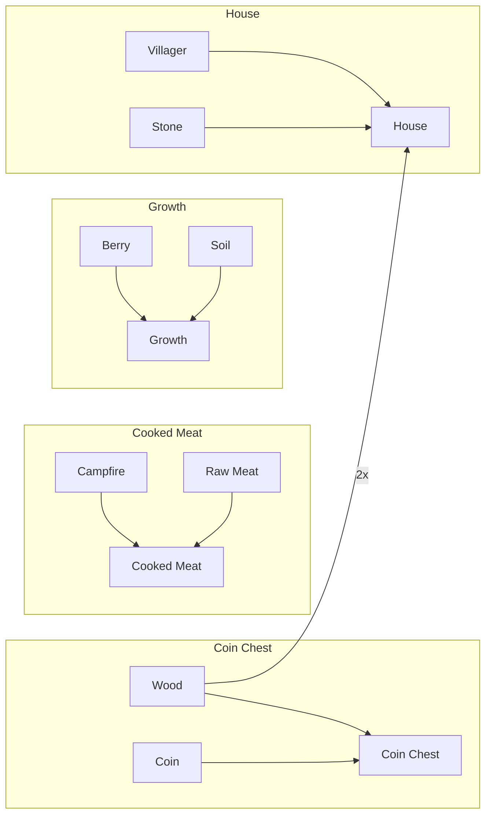

# Stacklands

```mermaid
%%{
init: {
"flowchart":{
"useMaxWidth": 0
}
}
}%%

graph LR

subgraph Coin Chest
coin[Coin] --> coin_chest[Coin Chest]
wood[Wood] --> coin_chest
end

subgraph Cooked Meat
campfire[Campfire] --> cooked_meat[Cooked Meat]
raw_meat[Raw Meat] --> cooked_meat
end

subgraph Growth
berry[Berry] --> growth[Growth]
soil[Soil] --> growth
end

subgraph House
wood -->|2x| house[House]
stone[Stone] --> house
villager[Villager] --> house
end 


```
