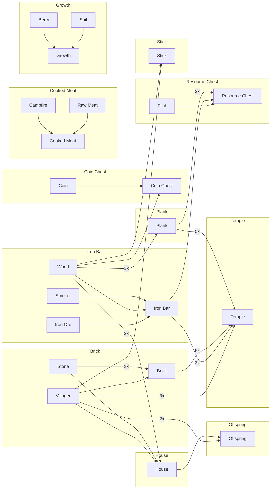

# Stacklands

```mermaid
%%{
init: {
"flowchart":{
"useMaxWidth": 0
}
}
}%%

flowchart LR

%% Resources
subgraph Brick
stone[Stone] -->|3x| brick[Brick]
villager --> brick
end

subgraph Iron Bar
smelter[Smelter] --> iron_bar[Iron Bar]
wood --> iron_bar
iron_ore[Iron Ore] --> iron_bar
end

subgraph Plank
wood -->|3x| plank[Plank]
end


subgraph Coin Chest
coin[Coin] --> coin_chest[Coin Chest]
wood[Wood] --> coin_chest
end

subgraph Cooked Meat
campfire[Campfire] --> cooked_meat[Cooked Meat]
raw_meat[Raw Meat] --> cooked_meat
end

subgraph Growth
berry[Berry] --> growth[Growth]
soil[Soil] --> growth
end

subgraph House
wood -->|2x| house[House]
stone[Stone] --> house
villager[Villager] --> house
end 

%% fix
subgraph Offspring
house --> offspring[Offspring]
villager[Villager] -->|2x| offspring
end

subgraph Resource Chest
plank[Plank] -->|2x| resource_chest[Resource Chest]
iron_bar --> resource_chest
flint[Flint] --> resource_chest
end

subgraph Stick
wood --> stick[Stick]
villager --> stick
end

subgraph Temple
plank -->|5x| temple[Temple]
brick -->|5x| temple
iron_bar -->|3x| temple
villager -->|3x| temple
end


%%linkStyle 16,18,19 stroke:red;
%%linkStyle 14,15 stroke:green;

```
